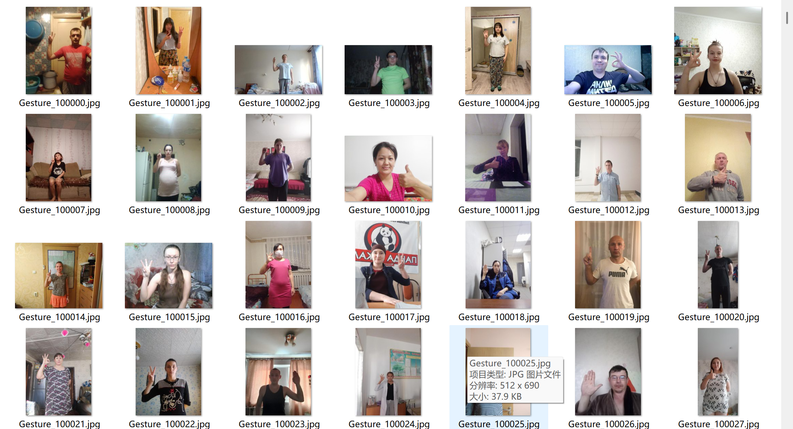
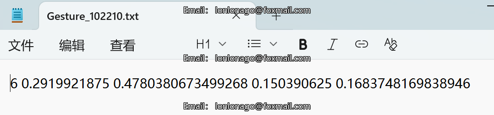
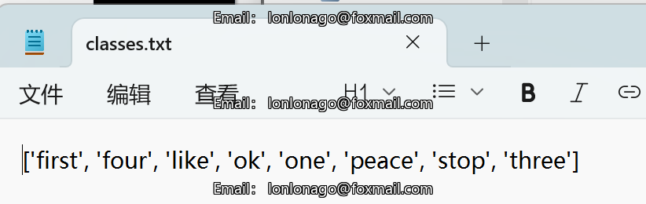
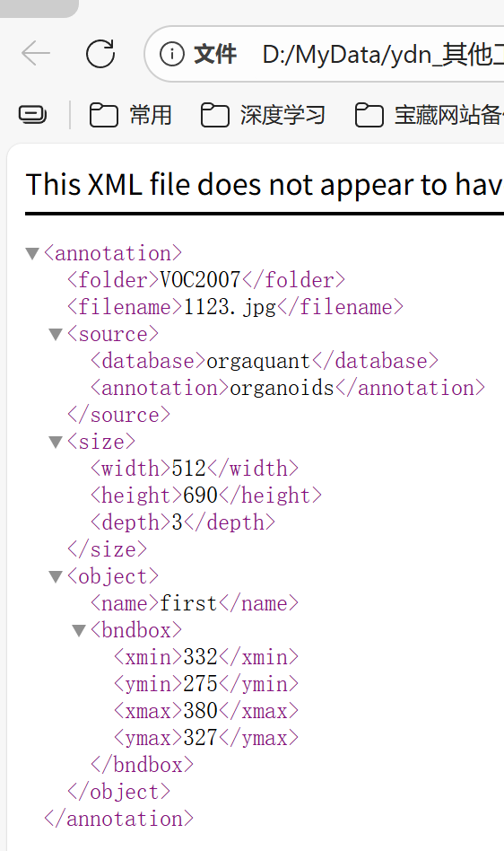
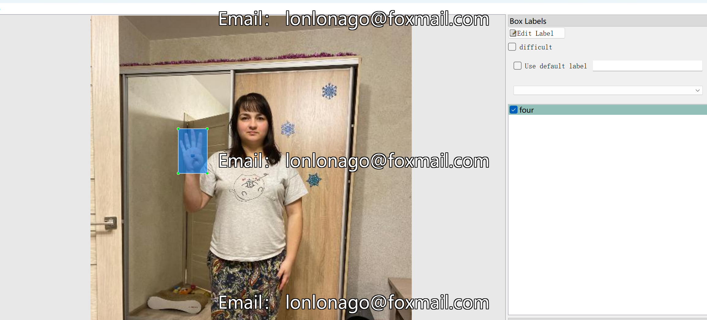

# Common Gesture Recognition - Object Detection Dataset

Dataset Information: The dataset consists of 30,000 images and corresponding annotation files. The format of the annotation files includes two types: VOC-formatted XML files and YOLO-formatted .txt files.

Annotation Box Counts: (Annotations are usually labeled in English, but Chinese subtitles are provided for reference within brackets)

Complete dataset includes three folders and a .txt file:

- all_images folder: Stores the dataset's images, screenshot included below:
- all_txt folder and classes.txt: Stores the .txt annotation files in YOLO format, numbered the same as the images, with each annotation file corresponding to one image.
- classes.txt:
- all_xml folder: VOC-formatted XML annotation files. Numbered the same as the images, with each annotation file corresponding to one image.

To view the standardized VOC format documentation, please search for information on your own.

Both formats of annotations can be used; choose one based on your preference.

Annotation Screenshots:

Image

Here is a pay link on Stripe ( https://buy.stripe.com/3cs8yP7sY87d0vu9AB ). Please contact me lonlonago@foxmail.com after funding $89, and I will send you a complete data files , thank you!

